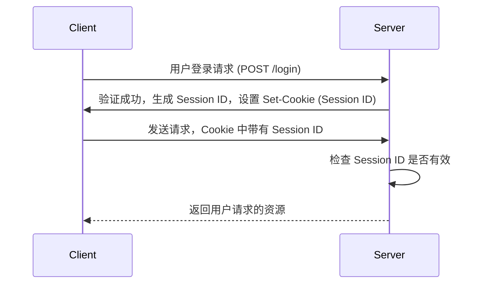
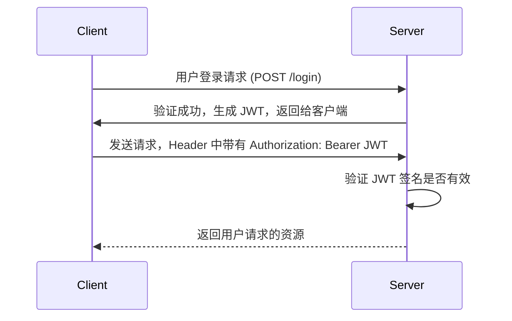

JWT、Cookie、Session、LocalStorage 和 SessionStorage 都是 Web 开发中用于管理用户身份、持久化数据和在客户端与服务器之间进行通信的方式。它们在作用和使用场景上各有不同。下面逐一分析它们的作用与区别：

---

### 1. **JWT (JSON Web Token)**

#### 作用：
JWT 是一种用于在客户端和服务器之间安全传输信息的紧凑、独立的令牌（Token），通常用于身份验证。服务器在用户登录成功后生成 JWT，并将其发送给客户端。客户端存储这个令牌，并在每次向服务器发送请求时，将 JWT 附带在请求头中，以证明用户的身份。

#### 主要特点：
- **结构**：JWT 由三部分组成：Header、Payload、Signature。通常是以 Base64 编码的字符串格式。
- **无状态**：JWT 是无状态的，不依赖服务器存储会话数据，因此非常适合微服务架构。
- **安全性**：JWT 通过签名验证数据是否被篡改，但注意不是加密，任何人都可以解码 JWT 内容。

#### 使用场景：
- 单点登录（SSO）
- RESTful API 身份验证

#### 优点：
- 无状态，服务器不需要存储 session 数据。
- 可以跨域、跨服务传递用户身份。

#### 缺点：
- 如果没有设计有效期，JWT 过期后无法撤销，除非手动管理黑名单。

---

### 2. **Cookie**

#### 作用：
Cookie 是一种存储在客户端的小型文本数据，通常用于在客户端与服务器之间存储状态信息。它可以包含用户身份、偏好设置或会话数据。服务器通过 `Set-Cookie` 响应头将 Cookie 发送给客户端，浏览器会自动将它们附加到随后的 HTTP 请求中。

#### 主要特点：

- **持久性**：Cookie 可以设置过期时间，如果不设置过期时间，它是会话级的（会话结束后失效）。
- **大小限制**：每个域名的总 Cookie 数据一般不能超过 4KB。
- **自动发送**：浏览器在同一域名的每个请求中自动发送 Cookie。

#### 使用场景：
- 用户会话管理（如存储用户登录状态）。
- 追踪用户行为（如广告跟踪）。

#### 优点：
- 可以通过 `HttpOnly` 和 `Secure` 属性提高安全性。
- 服务器可以通过响应头控制 Cookie 的生命周期。

#### 缺点：
- Cookie 会随每次请求自动发送，可能影响带宽和性能。
- 容易受到跨站脚本攻击（XSS）和跨站请求伪造（CSRF）攻击。

---

### 3. **Session**

#### 作用：

Session 是一种在服务器端存储用户会话数据的机制。它通过在客户端存储一个唯一的 `Session ID`（通常是通过 Cookie 实现），在服务器端对应这个 `Session ID` 保存实际的会话数据。用户登录时，服务器生成一个 `Session ID`，并将其发送给客户端，客户端在后续请求中发送这个 `Session ID` 以验证用户身份。

#### 主要特点：
- **状态化**：Session 是在服务器端保存的，与用户的身份和状态相关。
- **依赖 Cookie**：Session 通常通过 Cookie 保存 `Session ID`，也可以通过 URL 参数传递 `Session ID`。

#### 使用场景：
- 用户登录状态管理（服务器端持久化用户会话）。
- 存储敏感的用户数据。

#### 优点：
- 服务器端管理，用户无法直接修改数据。
- 安全性更高，适合存储敏感信息。

#### 缺点：
- Session 需要占用服务器内存或数据库资源，随着用户增加，服务器负担增加。
- 在分布式系统中需要解决 Session 共享的问题。

---

### 4. **LocalStorage**

#### 作用：
`LocalStorage` 是一种在浏览器中持久存储数据的机制。它允许存储键值对，并且没有过期时间，除非手动删除数据，它将一直存在。

#### 主要特点：
- **持久性**：数据在浏览器关闭后依然存在，除非手动删除。
- **大小限制**：一般每个域名的存储容量限制为 5~10MB。
- **访问限制**：只能通过 JavaScript 访问，服务器无法直接读取 `LocalStorage` 中的数据。

#### 使用场景：
- 存储长期的非敏感数据，如用户设置、首选项等。
- 用于浏览器中的缓存数据。

#### 优点：
- 存储空间较大，且持久化保存。
- 易于操作，可以用 JavaScript 轻松访问和修改。

#### 缺点：
- 不能用于存储敏感信息，因为它很容易受到 XSS 攻击。
- 不能被服务器端直接访问。

---

### 5. **SessionStorage**

#### 作用：
`SessionStorage` 与 `LocalStorage` 类似，但存储的数据仅在当前会话中有效。浏览器窗口关闭后，数据会被清除。它的存储方式也是基于键值对。

#### 主要特点：
- **会话级持久性**：数据在同一个标签页或窗口中保存，一旦窗口或标签页关闭，数据将被清除。
- **大小限制**：与 `LocalStorage` 类似，一般为 5~10MB。
- **访问限制**：只能通过 JavaScript 访问，服务器无法直接读取 `SessionStorage` 中的数据。

#### 使用场景：
- 临时存储的数据，如临时表单数据、单次会话的状态。
- 用于存储用户当前会话的非敏感数据。

#### 优点：
- 临时存储，不会占用持久存储空间。
- 在当前会话中快速访问。

#### 缺点：
- 数据在会话结束后消失。
- 不能用于存储敏感信息，因为它很容易受到 XSS 攻击。

---

### **总结与区别**

| **功能**     | **JWT**(身份验证)        | **Cookie**              | **Session**(身份验证)  | **LocalStorage** | **SessionStorage** |
| ------------ | :----------------------- | :---------------------- | ---------------------- | ---------------- | ------------------ |
| **存储位置** | 客户端                   | 客户端                  | 服务器端               | 客户端           | 客户端             |
| **持久性**   | 可配置，通常在到期后失效 | 可配置到期时间          | 会话结束或主动销毁     | 永久存储         | 当前会话结束后失效 |
| **大小限制** | 小                       | 小（约 4KB）            | 无限制（取决于服务器） | 大（约 5-10MB）  | 大（约 5-10MB）    |
| **安全性**   | 需加密/签名              | 可设置 HttpOnly、Secure | 服务器端管理           | 易受 XSS 攻击    | 易受 XSS 攻击      |
| **访问方式** | HTTP 请求头              | HTTP 请求头             | 服务器端管理           | JS 访问          | JS 访问            |
| **适用场景** | API 鉴权                 | 登录状态保持            | 用户身份管理           | 客户端持久化数据 | 会话内数据存储     |

选择合适的机制取决于应用场景和安全需求。例如，对于身份验证，JWT 和 Session 更为常见，而对于用户设置或缓存数据，LocalStorage 和 SessionStorage 则是很好的选择。

### 6. **有哪些存储数据的方法？**

在 Web 开发中，有多种方式可以存储数据，主要分为客户端存储和服务器端存储。

#### **客户端存储：**
- **Cookie**：一种小型数据存储方式，可以持久存储或基于会话存储，通常用于保存用户身份信息（如会话 ID）。浏览器会自动附加这些数据到同一域的 HTTP 请求中。
- **LocalStorage**：浏览器中的持久存储机制，适合存储大体量数据，无论浏览器关闭与否，数据都能保存，直到手动清除。
- **SessionStorage**：类似于 LocalStorage，但数据仅在当前会话中有效，窗口关闭后数据将丢失。
- **IndexedDB**：浏览器中的一种 NoSQL 数据库，适合存储结构化数据。
- **Web SQL**：一个已废弃的标准，允许使用 SQL 语句来管理浏览器内的数据库。
- **Service Workers Cache**：允许将 HTTP 请求和响应数据缓存到本地，以便在离线时使用。

#### **服务器端存储：**
- **Session**：服务器端存储方式，通过保存 `Session ID` 和用户的相关数据来管理会话。
- **数据库**：服务器端存储用户数据或持久化应用数据，例如 MySQL、MongoDB 等。
- **文件存储**：在服务器上直接将数据保存为文件（例如日志文件）。

### 7. **基于 Cookie/Session 和 JWT 的身份鉴权过程**

#### **基于 Cookie/Session 的身份鉴权过程：**

1. 用户发送登录请求，提供用户名和密码。
2. 服务器验证用户凭证，生成 `Session ID`，并将其存储在服务器中，通常通过 `Set-Cookie` 将 `Session ID` 返回给客户端。
3. 客户端的后续请求会自动带上 Cookie 中的 `Session ID`，服务器通过这个 `Session ID` 验证用户身份。
4. 服务器处理请求并返回响应。

#### **基于 JWT 的身份鉴权过程：**

1. 用户发送登录请求，提供用户名和密码。
2. 服务器验证用户凭证，生成 JWT（包含用户信息和签名）。
3. 客户端将 JWT 存储在 LocalStorage 或 Cookie 中，并在后续请求中通过 HTTP Header（通常是 `Authorization` 字段）将 JWT 发送给服务器。
4. 服务器通过解密 JWT 验证用户身份。
5. 验证通过后，服务器处理请求并返回响应。

#### 1. **JWT 和 Session 的区别**

#### **Session**

- **存储位置**：Session 数据存储在 **服务器端**。客户端通过 Cookie 保存一个 `Session ID`，每次请求时，服务器根据这个 `Session ID` 在服务器端找到对应的用户数据。
- **数据存储**：服务器端会存储用户的相关数据，Session 只是用来标识不同的客户端。所有敏感数据都存储在服务器端。
- **安全性**：Session 的安全性较高，因为敏感数据存储在服务器端，只有 `Session ID` 存储在客户端。
- **负担**：随着用户数量的增加，服务器需要维护的会话数据也增加，会增加服务器的存储和管理压力。

#### **JWT (JSON Web Token)**

- **存储位置**：JWT 完全存储在 **客户端**，通常存储在浏览器的 `LocalStorage`、`SessionStorage` 或 Cookie 中。每次请求时，客户端将 JWT 发送到服务器，服务器通过签名验证并解码 JWT。
- **数据存储**：JWT 本身就包含了用户信息（如用户 ID、权限等），这些信息通过 Base64 编码和签名的方式直接存储在 JWT 中。服务器通过验证 JWT 的签名来确认信息是否被篡改。
- **安全性**：由于 JWT 包含用户信息并存储在客户端，必须采取措施防止 JWT 被泄露（例如通过 HTTPS 传输数据）。JWT 本身不加密，需要结合签名和安全传输来保护数据。
- **无状态性**：服务器不保存会话信息，JWT 是无状态的。每次请求时，服务器只需要验证 Token 是否有效，无需在服务器端存储会话数据，因此适合分布式系统和扩展性需求。

#### **区别总结**：

1. **存储位置**：
   - **Session**：服务器端存储会话数据，客户端保存 `Session ID`。
   - **JWT**：客户端存储完整的 JWT，服务器不存储任何会话数据。
2. **数据携带方式**：
   - **Session**：`Session ID` 是唯一标识，实际数据存储在服务器端。
   - **JWT**：Token 包含了所有用户信息，服务器无需查找数据。
3. **扩展性**：
   - **Session**：需要依赖服务器端存储，扩展性较差，尤其在分布式系统中。
   - **JWT**：无状态，服务器可以随意扩展，不依赖会话存储。
4. **安全性**：
   - **Session**：数据存储在服务器端，敏感信息较为安全。
   - **JWT**：数据存储在客户端，容易暴露敏感信息，因此需要配合 HTTPS 和有效期管理。

###  8.**分类分开说明上面的名词**

#### **存储机制相关名词：**

1. **Cookie**：
   - **定义**：客户端存储机制，用于保存少量数据，并且自动随请求发送给服务器。
   - **作用**：通常用于存储用户的会话信息、追踪数据等。
   - **使用方式**：通过 HTTP 请求的 `Set-Cookie` 头设置，也可以通过 JavaScript 访问。

2. **LocalStorage**：
   - **定义**：浏览器提供的持久存储机制，可以存储较大量的键值对数据。
   - **作用**：保存较长时间的数据，如用户偏好设置、应用状态等。
   - **特点**：没有到期时间，数据除非手动删除，否则一直存在。

3. **SessionStorage**：
   - **定义**：浏览器提供的存储机制，数据仅在会话期间有效。
   - **作用**：存储短期数据，比如临时表单数据或会话中的状态信息。
   - **特点**：会话结束（窗口或标签页关闭）后，数据会自动清除。

4. **IndexedDB**：
   - **定义**：浏览器内的 NoSQL 数据库，适合存储大量结构化数据。
   - **作用**：用于存储离线应用数据、大量用户生成的数据。

5. **Session**：
   - **定义**：服务器端存储机制，用于保存用户的会话信息。
   - **作用**：通过保存 `Session ID`，服务器可以在会话期间识别用户。

#### **身份鉴权相关名词：**

1. **JWT (JSON Web Token)**：
   - **定义**：用于客户端与服务器之间传递用户身份信息的令牌，包含签名以确保数据未被篡改。
   - **作用**：用户登录时服务器生成 JWT，客户端将其用于后续身份验证。
   - **结构**：包含 Header（头部）、Payload（有效载荷）和 Signature（签名）。
2. **Session ID**：
   - **定义**：服务器生成的唯一标识符，用于识别用户的会话。
   - **作用**：存储在服务器端，客户端通过 Cookie 向服务器提供 `Session ID` 以进行身份验证。

#### **请求/响应相关名词：**

1. **HTTP 请求头**：
   - **定义**：HTTP 请求中的元数据，包含关于请求或响应的信息，如 `Authorization` 头可以用来传递 JWT。
   - **作用**：用于控制 HTTP 请求的行为和传递额外信息。

2. **Set-Cookie**：
   - **定义**：HTTP 响应头，用于服务器向客户端设置 Cookie。
   - **作用**：客户端接收后，在后续的请求中自动携带这些 Cookie。

#### **安全性相关名词：**

1. **HttpOnly**：
   - **定义**：Cookie 的一个属性，表示该 Cookie 只能由服务器端访问，JavaScript 无法操作。
   - **作用**：防止 XSS 攻击访问敏感的 Cookie（如 `Session ID`）。

2. **Secure**：
   - **定义**：Cookie 的一个属性，表示该 Cookie 只能通过 HTTPS 传输。
   - **作用**：确保 Cookie 通过加密的连接进行传输，防止被窃取。
   
   

### **总结：**

- **存储方式**：客户端有 Cookie、LocalStorage、SessionStorage、IndexedDB 等，服务器端主要是 Session 和数据库。
- **身份鉴权**：Cookie/Session 和 JWT 都可以用于身份验证，但机制不同。Cookie/Session 是状态化的，服务器端存储会话，JWT 是无状态的，所有信息都包含在 Token 内。
- **安全与效率**：JWT 更适合无状态和分布式系统，而 Session 适合需要服务器端管理用户状态的场景。

